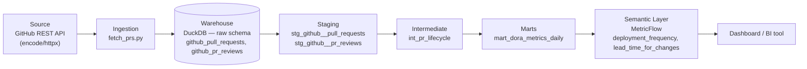

# PR Lifecycle & DORA Metrics — encode/httpx

An analytics engineering project that takes real GitHub pull request data from
[encode/httpx](https://github.com/encode/httpx) — a live, active open-source
project — through a full dbt pipeline to compute two [DORA](https://dora.dev/)
metrics: **Deployment Frequency** and **Lead Time for Changes**.

The point of this project isn't the metrics themselves — it's doing one data
entity properly end to end: layered modeling, tests that catch real bugs, a
semantic layer instead of ad-hoc SQL, and CI that actually runs. See
[PROGRESS.md](./PROGRESS.md) for the full build log and locked-in scope.

## Architecture



- **Ingestion** (`fetch_prs.py`) — pulls the 500 most recent PRs on `encode/httpx`
  via the GitHub REST API, plus every review on each one (one API call per PR,
  since GitHub doesn't expose reviews in bulk), into `raw.github_pull_requests`
  and `raw.github_pr_reviews` in a local DuckDB file.
- **Staging** — casts types and renames columns to consistent conventions.
  `stg_github__pr_reviews` stays one row per *review* (a PR can have zero, one,
  or many); nothing else touches its grain.
- **Intermediate** (`int_pr_lifecycle`) — the important join. Reviews are rolled
  up to one row per PR *first* (`min`/`max`/`count` over `submitted_at`), then
  left-joined onto the PR base, so the grain never fans out. Computes
  `review_wait_hours`, `time_in_review_hours`, and `lead_time_hours`.
- **Marts** (`mart_dora_metrics_daily`) — aggregates merged PRs to one row per
  calendar day, on a full date spine so zero-merge days are `0`, not a missing
  row.
- **Semantic layer** — `deployment_frequency` and `lead_time_for_changes`
  defined as MetricFlow metrics on top of the mart, queryable via `mf query`
  instead of being hardcoded SQL.

## Data dictionary — `mart_dora_metrics_daily`

| Column | Type | Description |
|---|---|---|
| `metric_date` | date | One row per calendar day. Primary key — spans the full range from the first to the most recent merge, with no gaps. |
| `deployment_frequency` | integer | Count of PRs merged on this day. A PR merge is used as a proxy for a deployment — see [Known limitations](#known-limitations--what-id-do-at-scale). Never null; `0` on days with no merges. |
| `avg_lead_time_hours` | float | Average `lead_time_hours` (PR opened → merged) across PRs merged this day, rounded to 2 decimals. **Null**, not `0`, on zero-merge days — there's nothing to average. |

## dbt tests

Every model's primary key gets standard `unique`/`not_null` tests. On top of
that, `int_pr_lifecycle` has a custom `non_negative` generic test
([`macros/generic_tests.sql`](./macros/generic_tests.sql)) on two columns:

| Test | What it actually catches |
|---|---|
| `non_negative` on `review_wait_hours` | Both durations are `date_diff(...)` between two timestamps pulled from the GitHub API. A negative value can only mean a timestamp parsing bug or a genuine source-data anomaly (e.g. clock skew). This exact class of bug showed up during development — a review submitted 56 days *after* its PR had already merged initially produced a negative `time_in_review_hours` before the model was fixed to guard it. |
| `non_negative` on `lead_time_hours` | Same failure mode, but on the column that feeds the Lead Time for Changes DORA metric directly — if this ever went negative, it would silently corrupt the mart and the semantic layer metric built on top of it. |

Run `dbt build` to run every model and every test in dependency order.

## Semantic layer

```
mf list metrics
mf query --metrics deployment_frequency,lead_time_for_changes --group-by metric_time__month
```

**Known caveat, by design:** `lead_time_for_changes` is defined as an
`average` measure over `mart_dora_metrics_daily.avg_lead_time_hours`, which is
*already* a daily average. That makes the metric an average of daily averages
(each day weighted equally), not a true PR-weighted average across all merges.
Building the semantic model on the pre-aggregated mart (rather than on
`int_pr_lifecycle` at PR grain) was a deliberate scope tradeoff — see below.

## Known limitations / what I'd do at scale

- **Deployment Frequency is a proxy.** There's no real deployment/release event
  data available from the GitHub PR API — only merges. At scale, I'd ingest
  actual deployment events (GitHub's Deployments API, or CI/CD pipeline logs)
  for a metric that reflects real production releases, not merges.
- **Lead Time for Changes measures PR-open-to-merge, not commit-to-production.**
  The full DORA definition is commit-to-production. At scale this would need
  commit timestamps and deploy timestamps, not just PR timestamps.
- **The semantic layer sits on a pre-aggregated mart, not PR grain.** As noted
  above, this makes `lead_time_for_changes` an average of daily averages. At
  scale, I'd build the semantic model on `int_pr_lifecycle` directly so
  MetricFlow can compute a true PR-weighted average and support slicing by
  author/reviewer/etc. that a daily mart can't offer.
- **Full refresh, not incremental.** `fetch_prs.py` re-pulls the most recent
  500 PRs every run, and every dbt model fully rebuilds. Fine at this scale
  (500 rows, sub-second rebuilds); wouldn't scale to a repo with 50,000+ PRs.
  At scale: incremental ingestion (GitHub's `since` param) and incremental dbt
  materializations keyed on `updated_at`.
- **One data source, on purpose.** This project deliberately covers PRs and
  reviews only, not commits, issues, or CI/CD workflow data — one entity done
  deeply rather than several done shallowly. A production DORA implementation
  would also need CI/CD data for the other two DORA metrics (Change Failure
  Rate, Time to Restore Service).
- **CI queries live data, so results aren't deterministic run-to-run.** CI
  re-fetches real data from `encode/httpx` on every push, which is realistic
  but means a green run today doesn't guarantee identical numbers tomorrow —
  the underlying repo keeps changing. At scale, I'd separate "does the
  pipeline logic work" (tested against a fixed fixture dataset in CI) from "is
  production data healthy" (monitored separately against live data).
- **No orchestration.** The pipeline only runs on `git push` via CI, not on a
  recurring schedule. At scale it would run on a schedule (Airflow, Dagster,
  or even a cron-triggered GitHub Actions workflow) so the marts and metrics
  stay fresh independent of code changes.

## Running it locally

```
pip install -r requirements.txt
export GH_TOKEN=your_github_pat        # any public-repo-read token works
python fetch_prs.py                    # pulls fresh PR + review data
dbt build                              # runs every model + test
mf list metrics                        # semantic layer, once dbt-metricflow is installed
```
